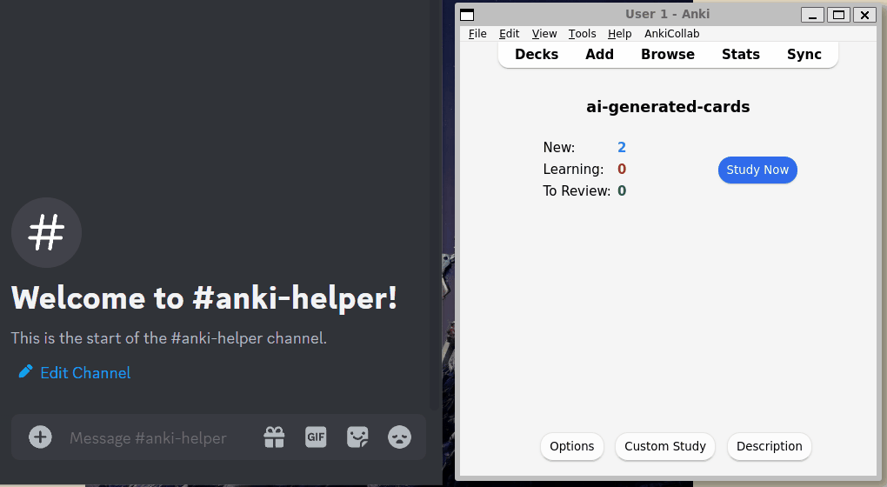

<!-- anki-helper/README.md -->

# Anki Helper

Anki Helper is a GPT-based AI assistant that creates entire Chinese flashcards in Anki from just 1 word. Save time while watching a show and instantly create cards with pinyin, translations, and example sentences.

Interfaceable through a Discord bot, the Anki Helper is currently available for self-hosting and development. WIP!

**Demo**



- [Usage](#usage)
- [Development](#development)

---
## Usage
### Prerequisites
Programs:
- [Python3](https://www.python.org/downloads/)
- [Anki](https://apps.ankiweb.net/)
  - [AnkiConnect add-on](https://ankiweb.net/shared/info/2055492159)

API Registrations and Keys
- [OpenAI API Key](https://help.openai.com/en/articles/4936850-where-do-i-find-my-api-key)
- [Discord Bot Token](https://discord.com/developers/applications)

### Setup
1. Install Python packages: `pip install requirements.txt`
2. Add Tokens and Keys to environment variables. View `config.py` to see suggested variable names.

If using a Python virtual environment, environment variables can be add in `<venv>/bin/activate` where `<venv>` is the directory of your virtual environment.

Example environment variables in virtualenv:
```sh
# .venv/bin/activate

deactivate() {
  ...

  # Unset my personal local environment variables
  # These were set at the bottom of this file
  unset OPENAI_API_KEY
  unset DISCORD_BOT_TOKEN
}
...

# My personal local environment variables
# Make sure to unset in deactivate() above
export OPENAI_API_KEY="openai-api-secret-key"
export DISCORD_BOT_TOKEN="discord.bot.token"
```
More info [here](https://stackoverflow.com/a/38645983/14514959).

### Hosting the App
1. Start Anki with Anki-Connect add-on
2. Run Anki-Helper: `python3 src/app.py`

*Notice: Anki with AnkiConnect add-on must be running for Anki-Helper to add cards*

### Using the Discord Bot
1. Add bot to server with [generated URL](https://discord.com/developers/docs/getting-started#step-1-creating-an-app).
2. Start using commands in the server!

Example bot command:
```
!add 帮手
```

## Development

### Roadmap
p0
- [x] ~~Create card from word using LLM.~~
- [x] ~~Add card to an anki deck.~~

p1
- Shared/Live deck collaboration.

### Issues
- won't create card if note type doesn't exist
- won't create card if deck doesn't exist
- discord gateway api starts sending loopback warnings when app responds slowly

### Improvements
- easier developer setup (e.g. containerize app)
- [x] ~~allow natural language instruction through bot (e.g. !add <word> with <sentence> as example)~~

### Tested Configuration:
- Anki v2.1.66+
  - AnkiConnect 
- Python 3.10.12

### Notes

- experiment with reordering keys in few shot examples to deal with hallucinations (worked out pretty well)